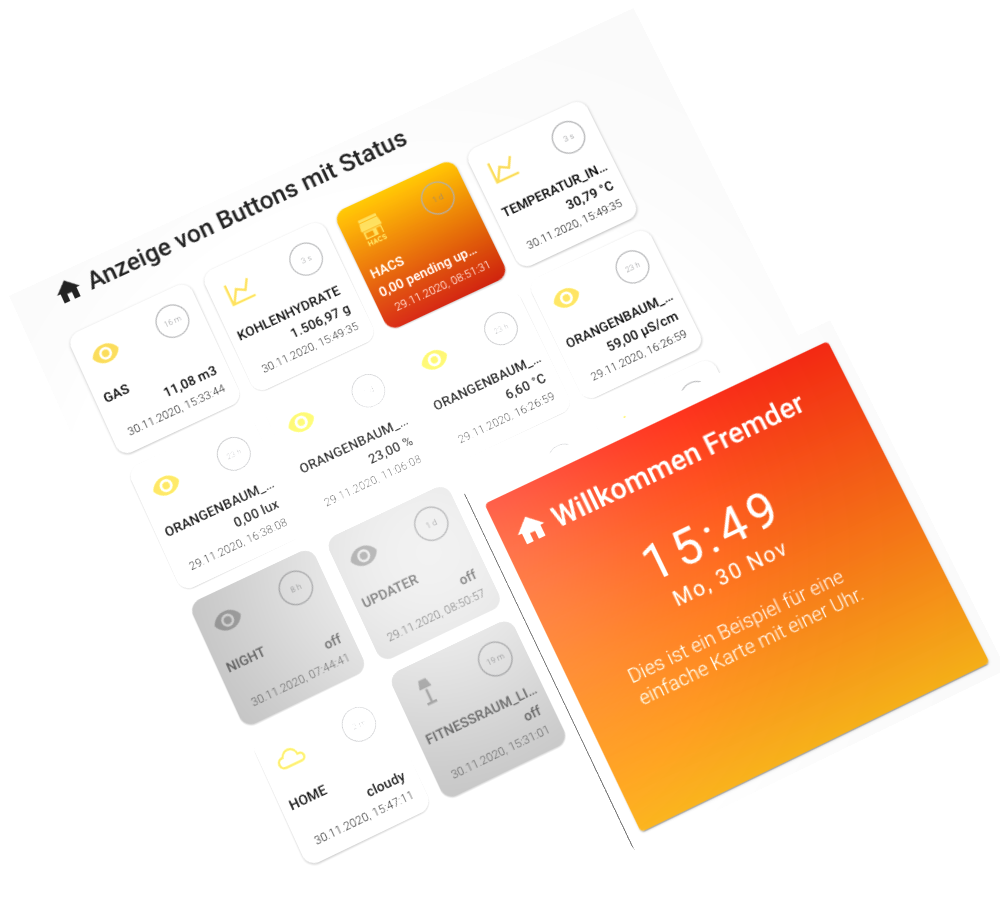

# Homeassitant Simple Card


> DEVELOPER PREVIEW VERSION NOT FINAL
> I'm still looking for help and would be happy if someone would get in touch to help me complete and improve the cards-layout.



## Requirements

- Home Assistant 0.116.4
  - Frontend-Version: 20201001.2 - latest
  - Lovelace Mode
- Tested Browser
  - Chrome Version 86.0.4240.111 
  - Safari Version 13.1.2 (13609.3.5.1.5)
  - Firefox 82.0 (64-Bit)
  - Vivaldi 3.4.2066.76 (Stable channel) (x86_64)
  - Android Browser (Chrome, Firefox, Vivaldi)


## stallation

### Manual install

1. Download the [latest release](https://github.com/zibous/ha-simplecard/releases), unzip and copy the folder `ha-simple-card` into your `$HOME/homeassistant/.homeassistant/www/community/ha-simple-card` directory.
   <br />

2. Add a reference to `ha-simple-card-min.js` inside your `ui-lovelace.yaml` or at the top of the *raw config editor UI*:

   ```yaml
   resources:
     - url: /hacsfiles/ha-simple-card/ha-simple-card.js
       type: module
   ```

   <br>

## Options Simple Card

| Name | Type | Default | Example
| ---- | ---- | ------- | -----------
| type | string | **Required** | `custom:simple-card`
| title | string | optional | 
| icon | string | optional | 
| text | string | optional | 
| style | string | optional  |
| entities | list | optional | 

## Options Simple Card clock

| Name | Type | Default | Example
| ---- | ---- | ------- | -----------
| type | string | **Required** | `custom:simple-card`
| title | string | optional | 
| icon | string | optional | 
| clock | string | **Required**  |
| style | string | optional  |
| text | string | optional | 
| entities | list | optional | 

## Options Simple Card buttons

| Name | Type | Default | Example
| ---- | ---- | ------- | -----------
| type | string | **Required** | `custom:simple-card`
| title | string | optional | 
| icon | string | optional | 
| mode | string | **Required**  | `buttons`
| style | string | optional  |
| text | string | optional | 
| entities | list | optional | 


### Options Simple Card buttons entities

| Name | Type | Default | Example
| ---- | ---- | ------- | -----------
| entity | string | **Required** | `sensor.orangenbaum_light`
| type | string | optional | `digitbutton`, `default`
| name | string | optional | overwrites the entity name
| icon | string | optional | overwrites the entity icon
| image | string | optional | used instead as entity icon
| style | string | optional | see `Entity Style examples`


### Entity Style examples

```yaml
- type: 'custom:simple-card'
   style: >
       background: linear-gradient(to top, #fc4a1a, #f7b733);
       color:#FFFFFF;
```
## Using the card

Add a custom card in your `ui-lovelace.yaml`

**Example**

```yaml
views:
  - title: Layout Simple card
    panel: true
    cards:
      - type: 'custom:cards-layout'
        title: Simple Card Testcases
        icon: 'mdi:tape-measure'
        width: 80%
        cards:
          - row:
              - col: null
                width: 50%
                height: 320
                entities:
                  - type: 'custom:simple-card'
                    title: Clock and Text
                    clock: true
                    style: >
                      height:300px; background: rgba(0, 0, 0, 0)
                      linear-gradient(rgb(241, 39,17), rgb(245, 175, 25)) repeat
                      scroll 0% 0%; height: 300px; color: #FFFFFF
                    title: Willkommen Fremder
                    icon: 'mdi:home'
                    text: >-
                      Dies ist ein Beispiel für eine einfache Karte mit einer
                      Uhr.
                    entities:
                      - sun.sun
          - row:
              - col: null
                entities:
                  - type: 'custom:simple-card'
                    title: Buttons
                    icon: 'mdi:home'
                    mode: buttons
                    entities:
                      - entity: sensor.gas_verbrauch_m3
                        name: Gas
                      - entity: sensor.kohlenhydrate_makronahrstoff
                        name: Kohlenhydrate
                      - entity: sensor.hacs
                        style: >
                          background: linear-gradient(to bottom, #ffc500,
                          #c21500);color: #FFFFFF;
                      - entity: sensor.temperatur_indoor
                      - entity: sensor.orangenbaum_light
                      - entity: sensor.orangenbaum_moisture
                      - entity: sensor.orangenbaum_temperature
                      - entity: sensor.orangenbaum_conductivity
                      - entity: binary_sensor.night
                      - entity: binary_sensor.updater
                      - entity: sensor.gasuhr_status
                      - entity: sun.sun
                      - entity: weather.home
                      - entity: light.fitnessraum_licht
                        icon: 'mdi:floor-lamp'

```
<a href="https://www.buymeacoff.ee/zibous" target="_blank"></a>


## TODO
 - better css handling (load css once not per card)

## Helper

- [YAML to JSON Online](https://www.convertjson.com/yaml-to-json.htm) - Use this online tool to convert YAML into JSON. 
- [JSON to YAML Online](https://www.convertjson.com/json-to-yaml.htm) - Use this online tool to convert JSON into YAML. 
- [uiGradients](https://uigradients.com/#ByDesign)  - Beautiful colored gradients


## Credits

- [Homekit-panel-card](https://github.com/DBuit/Homekit-panel-card) - Homekit panel card for home assistant 
